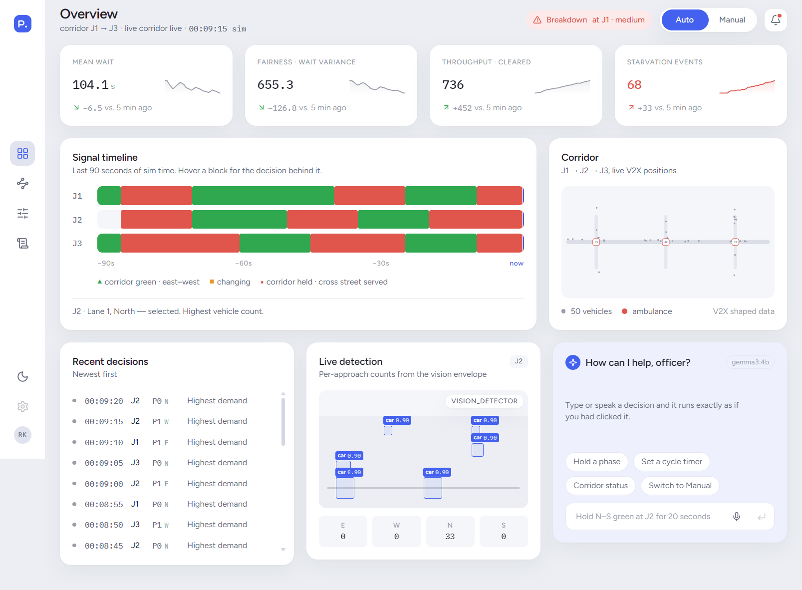
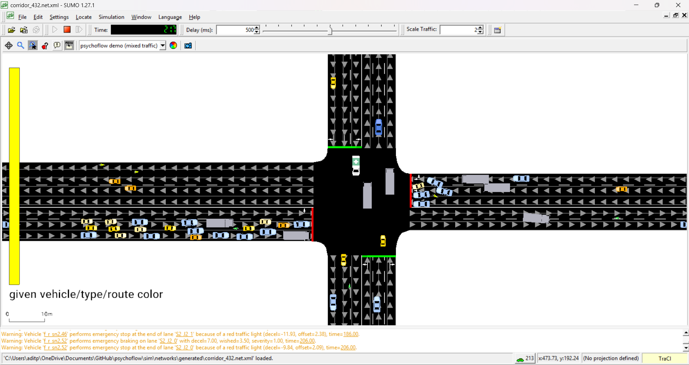
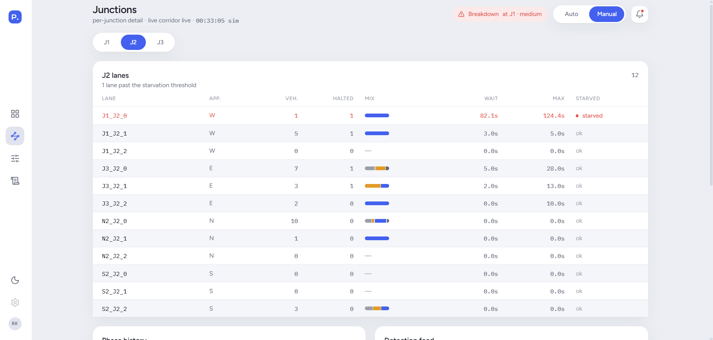
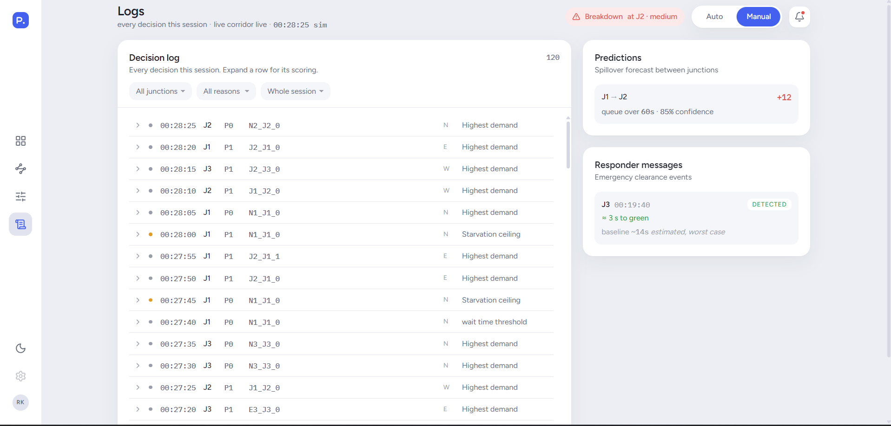
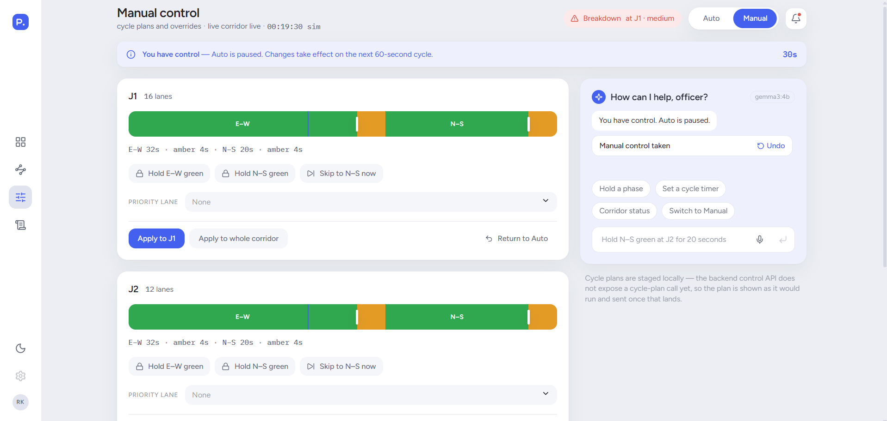

# PsychoFlow

**An agentic, multi-modal traffic-flow optimization and road-safety response system.**
Built by a team of 5 at **Smart Horizon — 48-Hour Hackathon 2026.**




---

## TL;DR

PsychoFlow controls a 3-junction traffic corridor (`J1 → J2 → J3`) simulated in SUMO, end to end, through a pipeline of cooperating agents: **perception → prediction → a PPO-trained signal-control policy → a hard rule-based safety floor → coordinator/explainability → a live operator dashboard with voice control.** One person did ~3.5 weeks of solo pre-event architecture and hardening; a team of 5 built the rest live over 48 hours.

What makes it different from "an AI traffic light":

- **A rule-based safety validator sits between every learned decision and the road.** No lane can starve past a hard ceiling, and an approaching ambulance preempts everything — by construction, not because the model usually behaves.
- **Every decision is explainable on demand** — a structured decision log, plain-language narration, and a live "why did you do that?" query. Not a black box.
- **A live Greedy-vs-PsychoFlow side-by-side** on identical traffic makes the fairness claim falsifiable on screen instead of asserted in a pitch.
- **A local-only voice layer** — no cloud/paid model anywhere in the decision path — lets an operator say things like *"give lane 3 more priority for the next five minutes"* and watch the dashboard react.
- **A first attempt at authentic Indian mixed-traffic behavior** (two-wheelers filtering to the front of a queue, lane-sharing rather than strict lane discipline) using SUMO's sublane model — flagged honestly below as a demo-only addition, not part of the trained/measured system.

Full build documentation lives in [`docs/PsychoFlow_Master_Plan.md`](docs/PsychoFlow_Master_Plan.md) (the single source of truth this was built from) and [`docs/MIXED_TRAFFIC_RESEARCH.md`](docs/MIXED_TRAFFIC_RESEARCH.md).

---

## Table of Contents

- [Screenshots](#screenshots)
- [The Problem](#the-problem)
- [What It Does](#what-it-does)
- [Architecture](#architecture)
- [Tech Stack](#tech-stack)
- [Repo Structure](#repo-structure)
- [How This Was Built](#how-this-was-built)
- [Deep Dive: Every Module](#deep-dive-every-module)
- [Measured Results](#measured-results)
- [Honest Scope & Boundaries](#honest-scope--boundaries)
- [Getting Started](#getting-started)
- [Roadmap](#roadmap)
- [Team](#team)
- [License](#license)

---

## Screenshots

> This system only runs locally (SUMO + a local LLM + the backend + the frontend all on one machine), so these are the only way to see it work without running it yourself. All images live in [`docs/Screenshots/`](docs/Screenshots).

| | |
|---|---|
| **Operator dashboard — Overview** | **SUMO GUI — live corridor simulation** |
|  |  |
| **Junctions — per-junction detail** | **Logs — every decision this session** |
|  |  |
| **Manual control — cycle plans and overrides** | |
|  | |

---

## The Problem

Urban corridors lose time and safety to siloed systems — a fixed signal plan, a CCTV feed nobody is cross-referencing against anything else, a separate incident hotline, a separate weather feed — and a human operator trying to reconcile all of it manually, especially during an incident. That produces delayed clearance, secondary accidents, and avoidable emissions.

The challenge PsychoFlow was built against asked for a multi-agent AI system that:
- Detects incidents and predicts their downstream (spillover) impact from multi-modal signals
- Proposes and validates safe interventions under real constraints
- Coordinates responder actions and produces explainable, human-readable reasoning for both operators and the public

## What It Does

- **Perceives** a corridor through five channels merged into one live digital twin: per-lane sensing, a vision feed (mock by default, with a real local-detector path wired in), structured incident intake, weather state, and V2X-shaped connected-vehicle data.
- **Predicts** spillover queue growth at downstream junctions and the delay ripple of an active incident, ahead of it becoming visibly congested.
- **Controls** signal phases with a PPO policy that starts from a fairness-first rule-based baseline and learns when to deviate from it — faster rotation under rush-hour density, longer greens off-peak, without ever fully starving a quiet approach.
- **Guarantees a safety floor** independent of the learned policy: a hard starvation ceiling and an unconditional emergency-vehicle override, enforced structurally, not statistically.
- **Coordinates across the corridor**: a graph-attention model lets each junction's decision take its neighbors' state into account, benchmarked against a simpler shared-policy fallback.
- **Explains itself**: a structured technical decision log, plain-language narration, and a live "why did you do that?" query interface answered from the actual log entry, never a canned response.
- **Takes voice commands**: browser speech-to-text → a local LLM (Gemma via Ollama) parses intent → the same control API the dashboard buttons use. No Claude API or paid model anywhere in that runtime path.
- **Shows its work as a multi-agent system, visibly**: a live activity feed names the agents actually running — Detection, Vision, Prediction, IncidentPriority, Control, Supervisor — rather than presenting one opaque "AI."

## Architecture

```
                         BROWSER (React + TypeScript)
   Overview │ Manual Control │ Junctions │ Logs │ Voice/Chat Assistant
                                    │ WebSocket (live state, every sim step)
┌───────────────────────────────────▼────────────────────────────────────┐
│                        FastAPI Backend (Python)                        │
│                                                                          │
│  PERCEPTION                                                             │
│   per-lane sensing │ vision (mock/real) │ incidents │ weather │ V2X     │
│                              │                                          │
│                              ▼                                         │
│                    DIGITAL TWIN (shared corridor state)                │
│                              │                                          │
│              ┌───────────────┴────────────────┐                        │
│              ▼                                 ▼                        │
│        PREDICTION                    CORE INTERVENTION                 │
│   spillover + incident impact     fairness-first baseline               │
│                                    + PPO (single-agent, deployed)        │
│                                    + graph-attention MARL (shadow-only)  │
│              │                                 │                        │
│              └───────────────┬─────────────────┘                        │
│                               ▼                                         │
│               SAFETY & POLICY VALIDATOR                                 │
│         starvation ceiling │ emergency override │ pre-execution check   │
│                               │                                         │
│              ┌────────────────┴───────────────┐                        │
│              ▼                                 ▼                       │
│         COORDINATOR                    EXPLAINABILITY                   │
│   emergency clearance              decision log │ narration │ Q&A        │
│   responder messaging                                                  │
│                               │                                         │
│                    VOICE INTENT HANDLER                                │
│         Web Speech / Whisper (STT) → local Gemma (Ollama) → control API │
└──────────────────────────────────────────────────────────────────────────┘
                                    ▲
                          (trained offline, background)
┌──────────────────────────────────────────────────────────────────────────┐
│   Training: Scenario Randomizer → SUMO → Gymnasium Env → PPO(+attention)  │
│   Agent → Reward → Policy Update → repeat                                │
└────────────────────────────────────────────────────────────────────────────┘
```

**Plain-English flow:** training happens offline and produces a checkpoint. The backend loads it and drives a live SUMO instance over TraCI, streaming corridor state to the browser every simulation step. Voice is a separate input channel into the exact same control API the dashboard buttons call.

## Tech Stack

| Layer | Choice |
|---|---|
| Simulation | SUMO + TraCI (sublane model for mixed-traffic realism) |
| RL framework | Stable-Baselines3 (PPO), `sb3-contrib` (`MaskablePPO`) |
| Environment | Gymnasium, padded/masked observation & action space |
| Backend | FastAPI + WebSockets, Python 3.11 |
| Frontend | React + TypeScript + Vite, Zustand for state |
| Voice | Web Speech API / local Whisper (STT) + Ollama running Gemma (intent parsing) |
| Prediction | Lightweight heuristic models, not a new ML framework |

Everything above is free and runs locally — the only real cost anywhere in this stack is your own machine's CPU time for RL training.

## Repo Structure

```
psychoflow/
├── docs/                 # master plan, mixed-traffic research, build log
├── sim/                  # corridor generator, scenario randomizer, demo/watch scripts
├── perception/           # lane sensing, vision, incidents, weather, V2X-shaped data
├── twin/                 # digital twin — the one shared source of truth every module reads
├── prediction/           # spillover forecasting, incident-impact estimation
├── env/                  # Gymnasium wrapper, reward function, obs/action spec
├── agents/               # Tier-0 rule-based controller, PPO/MARL feature extractors
├── safety/               # the validator — starvation ceiling, emergency override
├── coordinator/          # emergency clearance, responder messaging
├── explainability/       # decision log, narration, "why did you do that" queries
├── orchestrator/         # runs the perception→prediction→intervention pipeline and
│                         #   publishes the live agent-activity feed the UI shows
├── iot/                  # roadside sensor input (live-only; dashboard degrades
│                         #   gracefully to "no signal" when absent)
├── training/             # PPO entry point, curriculum stages, checkpoints
├── backend/              # FastAPI app, WebSocket server, control API, voice pipeline
├── frontend/             # React app — Overview / Manual / Junctions / Logs / Assistant
├── evaluation/           # metrics, emissions estimate, generalization test
└── tests/
```

## How This Was Built

One person did the pre-event architecture, design-plan reviews, and hardening — corridor generation, perception, the RL environment and reward function, safety validation, the rule-based Tier-0 controller, PPO training across a five-stage curriculum, MARL coordination, the coordinator/explainability layer, and the backend — over about 3.5 weeks, working with **Claude Code** as a coding agent and **Claude** as an independent second reviewer of its reasoning, math, and design proposals before anything got merged. Frontend, the voice pipeline, and the evaluation suite were deliberately reserved and built live by the full 5-person team during the 48-hour event itself.

A recurring discipline throughout: don't accept a "done" or "passed" claim without seeing the actual command output behind it, and don't let a metric ship if it turns out to measure the safety net rather than the policy underneath it. A few real examples that surfaced and got corrected before being written down as fact:
- An early "near-100% emergency priority" reading turned out to measure the safety validator catching every ambulance by construction — true for *any* policy, including a random one. The metric was redefined to isolate what the *policy* does on its own initiative, which is the honest number reported below.
- A "0 collisions, mixed traffic looks realistic" claim was held back until it could be verified by an actual human watching the SUMO GUI — not just a passing test suite — because no automated check can confirm driving behavior *looks* authentically Indian.

## Deep Dive: Every Module

<details>
<summary><b>Perception layer — five channels merged into one digital twin</b></summary>

<br>

- **Per-lane sensing:** vehicle count, halted count, per-type composition, current and worst-single-vehicle wait time, a starvation flag — read continuously via TraCI.
- **Vision:** a mock by default (re-emits the same ground truth through a camera-shaped interface with a synthetic confidence score), with a real local-detector path wired in behind a `--vision-source` flag so downstream code never has to know which one is live.
- **Incident intake:** structured events (`lane_blocked` / `accident` / `roadworks`), the same shape a human hotline operator would log — not free text.
- **Weather:** a state machine (`clear` / `rain` / `heavy_rain`) that actually changes SUMO's driver-behavior parameters on transition, not just a cosmetic label.
- **V2X-shaped data:** TraCI vehicle state, reformatted and given a realistic noise model (delay, drop rate, position jitter) — not a full network-layer V2X simulator, which would have added toolchain risk for zero visible difference on a demo screen.
- **Digital twin:** one object, updated every simulation step, that every downstream module reads from exclusively. This is what guarantees every decision in the system is made against the same reality.

</details>

<details>
<summary><b>Prediction — spillover forecasting and incident impact</b></summary>

<br>

Spillover forecasting extrapolates each downstream junction's own queue growth rate forward over a 60-second horizon, using only digital-twin state and corridor adjacency — no route/destination data exists to isolate per-vehicle turning behavior, so net queue growth is used as the proxy for "current outflow rate from upstream." Confidence is a fixed baseline (0.85, cold-start 0.5), reduced when an incident is active downstream.

Incident-impact prediction estimates delay ripple as a hop-decayed sum across every junction reachable downstream of the incident — sum, not max, so the estimate actually reflects how far the disruption travels rather than collapsing to the incident's own junction regardless of distance.

</details>

<details>
<summary><b>Core intervention — Tier-0 baseline, PPO, and the safety floor</b></summary>

<br>

**Tier 0 (rule-based, the guaranteed floor):** `score(lane) = 0.6 × halted_count + 0.4 × wait_time_current + a non-linear starvation bonus` as a lane's wait approaches the ceiling. This is the entire decision rule, and also the seed the RL agent starts from and learns to deviate from — not replaced by RL, extended by it.

**PPO:** trained with `MaskablePPO` over a five-stage curriculum (fixed topology → lane-count variation → density/traffic-mix randomization → emergency events → MARL coordination), with observation/action spaces padded and masked so the agent can never select a phase that's invalid for the current topology.

**The safety validator:** an independent, rule-based gate between every proposed action and the road. It enforces a hard starvation ceiling and an unconditional emergency-vehicle override — nothing in the system, including the learned policy, can disable it on a live path.

</details>

<details>
<summary><b>Corridor-wide coordination (MARL) — two honest, separate findings</b></summary>

<br>

Two different questions were asked here, and the answers must be kept separate rather than blended into one headline number:

1. **"Which MARL architecture is better, if you're going to use MARL at all?"** A graph-attention feature extractor (each junction attends over its direct neighbors' state before selecting a phase) was benchmarked against a simpler shared-policy fallback (one set of weights applied independently everywhere, no explicit neighbor state). **Graph-attention won 12/12** on starvation rate (1.64% vs. 86.60%).
2. **"What actually drives the corridor in the demo?"** Despite winning that architecture comparison, the single-agent Stage-4 PPO checkpoint measurably outperformed the graph-attention MARL checkpoint on the deployment bake-off (0 starvation events / 0 safety-validator overrides / 38–42s worst wait, vs. 4 events / 1 override / 121–125s — and 0.08% vs. 1.20% starved across a 48-episode grid). **Single-agent PPO is what's deployed.** The graph-attention checkpoint still runs alongside it as a read-only "shadow advisor," streamed for comparison on every frame but never touching the road.

Both statements are true and neither contradicts the other — they answer different questions, and the system says so out loud rather than picking whichever one sounds better.

</details>

<details>
<summary><b>Coordinator & explainability</b></summary>

<br>

On an emergency, the coordinator clears the corridor and generates a structured responder-facing message (decision support, not an integration with a real dispatch/CAD system). Every decision — automatic or voice-triggered — writes to a technical decision log, is rendered through plain-language narration templates, and can be queried live: "why did you do that?" pulls the real log entry for that time/lane rather than answering with anything canned.

</details>

<details>
<summary><b>Voice layer</b></summary>

<br>

`Officer speaks → browser/local speech-to-text → local Gemma via Ollama (intent + function-calling) → the same control API the dashboard uses → dashboard updates.` Supported commands include switching modes, biasing a lane's priority for a set duration, asking for current wait times, and declaring an emergency vehicle. An unparseable command fails closed — "Command not understood, please try again" — rather than guessing and taking a random action.

**Honest note on "local":** intent parsing genuinely never leaves the machine and never calls a paid model. Browser speech-to-text, if that path is used, is not local — it streams audio to a cloud speech service. The accurate claim is "no paid/cloud inference anywhere in the decision path," not "fully local end to end."

</details>

<details>
<summary><b>Mixed-traffic realism (demo-only, not on the training path)</b></summary>

<br>

SUMO's sublane model gives vehicles a continuous lateral position inside a lane, which lets a two-wheeler filter past a car without leaving the lane structure entirely — approximating Indian mixed-traffic driving behavior far better than strict single-file lane discipline. Measured on this corridor: queue-front filtering shifts the bike/car ordering by roughly 2.94×, 0.00% collisions, and lane-sharing at 51.38% against a ~62% target.

Two things worth being upfront about, because they matter more than the headline numbers:
- **This sits outside the training and evaluation path by design.** The deployed policy trained under SUMO's default lane-disciplined model, so no performance number anywhere else in this repo was measured under the mixed-traffic model, and none should be compared against it.
- **The parameter values are reasoned engineering defaults for this corridor, not transcribed from a specific study.** `docs/MIXED_TRAFFIC_RESEARCH.md` separates, section by section, what's sourced-but-directional, what's a reasoned default, and what this repo actually measured — only the last category should ever be quoted as something PsychoFlow measured.

</details>

## Measured Results

**Tier 0 (rule-based) vs. a random policy, both under the safety validator** — corridor 4/3/2 lanes, seed 7:

| Metric | Random, no validator | Random, validator on | Tier 0 |
|---|---|---|---|
| Mean reward / step | −224.8 | −2.4 | **+1.2** |
| Worst single-vehicle wait | 793s | 141s | **41s** |
| Steps with a starved lane | 87% | 84% | **0%** |
| Safety-validator overrides needed | — | 121 | **0** |

The validator alone is what turns a gridlocked corridor into one that drains — both validator-on rows finish the episode early with every vehicle arrived, where the unshielded run never does. Tier 0 never needs a single override, which is the intended result: its own fairness bonus keeps every lane under the ceiling before the hard gate ever has to fire.

**Emergency-vehicle handling — stated exactly as the team agreed to say it to judges:** on held-out episodes, the trained policy served an approaching ambulance on its own initiative on roughly three-quarters of decision steps where one was present (0.83, vs. 0.64 for chance, p = 0.0007) — measurably better than chance, but it cannot fully anticipate an emergency because sensing only registers an ambulance once it's on the junction's own approach lane. The safety validator remains the hard guarantee underneath: it still has to fire in roughly 8 of 10 episodes, and it catches every ambulance, by construction, not by training.

## Honest Scope & Boundaries

<details>
<summary>Click to expand — what's real, what's simulated, and what's not built</summary>

<br>

- No real traffic cameras, weather services, or emergency-dispatch integration — everything is simulated with a realistic data shape, not live-integrated.
- "V2X" means structured, realistically-imperfect connected-vehicle data generated from the simulation, not a full network-layer V2X communications stack.
- Coordinator/responder messaging is decision-support output, not an actual dispatch system.
- Interventions are signal-phase control and emergency-corridor clearance only — the system detects and predicts the impact of a lane blockage and re-times around it, but it never issues an actual closure order.
- Coordination runs as one shared neighbor-aware policy in a single forward pass (centralized execution across 3 junctions), not three independently negotiating agents at runtime.
- The control API is unauthenticated by design — a local demo surface bound to loopback by default, not a hardened service. If this were ever exposed beyond localhost, an auth layer is a prerequisite, not an enhancement.
- There is no fixed-timer/round-robin controller anywhere in the running system — only Tier 0 (rule-based), the trained PPO policy, and Greedy exist as real, selectable controllers.
- The voice layer is "no paid/cloud inference in the decision path," not "fully local" — see the voice section above.
- The mixed-traffic driving model is demo-only, sits outside the trained/measured system, and its own pass/fail bar was always meant to be a human actually watching the SUMO GUI and confirming it looks right — no test suite substitutes for that judgment call.

</details>

## Getting Started

```bash
# 1. Install checklist — verify each
git --version
python --version        # 3.10 or 3.11 only
sumo --version           # set SUMO_HOME — TraCI won't import without it
node --version && npm --version
ollama --version          # then: ollama pull gemma3

# 2. Python dependencies
pip install stable-baselines3[extra] sb3-contrib gymnasium sumolib traci \
    numpy matplotlib fastapi uvicorn websockets pydantic ollama

# 3. Frontend dependencies
cd frontend && npm install

# 4. Run the live demo (adjust the venv path for your OS)
venv/Scripts/python.exe sim/run_demo.py --stt whisper
```

All training runs locally on CPU — SUMO is CPU-bound, not GPU-bound. If your machine is too slow to get through the training curriculum in reasonable time, Google Colab's free tier is a reasonable overflow for training runs specifically.

## Roadmap

- Wire a "set 60-second cycle plan" control-API endpoint (the manual-control cycle editor currently only shows the optimistic result).
- Swap the placeholder vision feed for a fully calibrated real local-detector path (per-approach regions + stop-line calibration for distance estimates).
- Verify the optional Sarvam cloud STT path against the live service (currently implemented from documentation only, unverified end to end).
- Y-merge topology generalization — deliberately deprioritized; the problem statement never asked for it, and it's only worth building with real slack time left over.

